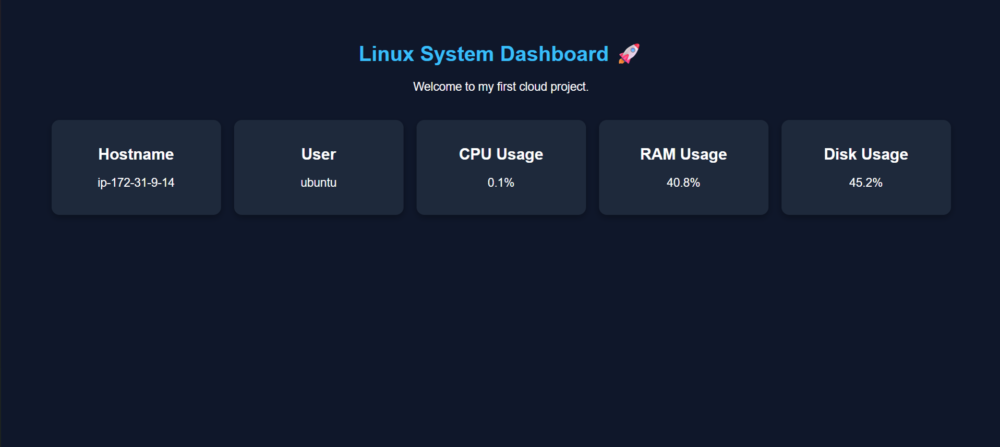

# Linux System Dashboard 🚀

A Flask-based Linux monitoring dashboard deployed on AWS EC2.

## Dashboard Preview

## Features

* Display Hostname
* Display Logged-in User
* Monitor CPU Usage
* Monitor RAM Usage
* Monitor Disk Usage
* Auto Refresh Dashboard
* AWS EC2 Deployment
* Nginx Reverse Proxy
* Gunicorn Application Server

## Tech Stack

* Python
* Flask
* HTML
* CSS
* psutil
* Git & GitHub
* AWS EC2
* Gunicorn
* Nginx

## Project Architecture

User Browser

↓

Nginx

↓

Gunicorn

↓

Flask Application

↓

psutil

↓

Linux System Metrics

## Dashboard Metrics

* Hostname
* Current User
* CPU Usage (%)
* RAM Usage (%)
* Disk Usage (%)

## Installation

Clone the repository:

git clone https://github.com/Mansii-Gaur/Linux-System-Dashboard.git

Move into project directory:

cd Linux-System-Dashboard

Create virtual environment:

python3 -m venv venv

Activate virtual environment:

source venv/bin/activate

Install dependencies:

pip install -r requirements.txt

Run application:

python3 app.py

## AWS Deployment

This project is deployed on AWS EC2 using:

* Ubuntu Server
* Security Groups
* SSH Access
* Gunicorn
* Nginx Reverse Proxy

## Future Improvements

* HTTPS with SSL Certificate
* Custom Domain
* Docker Containerization
* CI/CD Pipeline
* Monitoring & Logging

## Author

Mansi Gaur

GitHub: https://github.com/Mansii-Gaur
